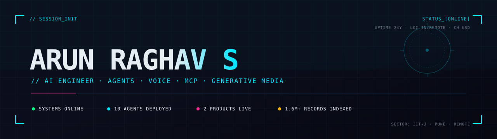

<div align="center">
  
</div>

<br/>

## `// MISSION LOG`

Hi, I'm Arun. I build AI systems — agents, voice, RAG, MCP servers, generative media pipelines.

By day, **Analyst @ [BNY Mellon](https://bnymellon.com)** — Markets, Corporate Treasury (Pune). By night and weekends, co-founding **[Crayonz.ai](https://crayonz.ai)** (custom apparel with an AI design studio + agent tools for design and video generation) and **[IItianVibes](https://iitianvibes.com)** (collegiate merch, live across IITs — with an Instagram DM agent that closes orders end-to-end).

Previously **AI Engineer @ [Propzing / prop8t.ai](https://prop8t.ai)** (Dubai real-estate AI — voice, WhatsApp, and multi-agent research) and **AI Engineer Intern @ [Otsuka Corporation](https://www.otsuka.co.jp/en/)** in Tokyo. **IIT Jodhpur** — B.Tech Computer Science, 2025.

Also occasionally writing at **[iitianvibes.com/blog](https://iitianvibes.com/blog)** — the IIT-life journal (research, news, culture) that runs on an Astro static site + an automated content pipeline I built.

<br/>

## `// AGENTS DEPLOYED`

| Callsign | Class | Payload | Status |
|---|---|---|---|
| **IItianVibes IG DM Commerce** | LangGraph state machine | 23 tools · product search · cart · address · Cashfree checkout · Qikink POD · fuzzy college matching | `🟢 LIVE` |
| **Crayonz MCP Server** | Cloudflare Workers | 40 tools · OAuth 2.0 · usable from Claude / ChatGPT / Perplexity / Mistral | `🟢 LIVE` |
| **Propzing Voice Agent** | OpenAI Realtime | 39+ tools · 1.6M+ real-estate records · sub-second latency · Exotel telephony | `🟢 LIVE` |
| **Propzing WhatsApp Agent** | Pub/Sub microservice | Auto-scale 1 → 8,000+ concurrent · multilingual (EN / HI / TA / TE) | `🟢 LIVE` |
| **Crayonz Design Studio** | Fabric.js + Pollinations + Gemini 2.5 | Real-time apparel mockups · displacement-mapped canvases · AI-generated designs | `🟢 LIVE` |
| **Content-API** | FastAPI on Cloud Run | 6 generative endpoints — post · reel · blog · listing · calendar planner · analytics | `🟢 LIVE` |
| **MemAgent** | LLM + imgflip pipeline | Brainstorm → refine → render → QA · template registry · caption optimizer | `📦 SHIPPED` |
| **HyperFrames** | HTML → MP4 renderer | 7 runtime adapters (GSAP / Lottie / Three.js / Anime / CSS / WAAPI / TypeGPU) · beat-synced audio | `📦 SHIPPED` |
| **Advanced RAG** | Multi-modal retrieval | Text + tables + VLM image summaries · custom multi-vector retriever · +25% accuracy | `📦 SHIPPED` |
| **IItianVibes Journal** | Astro + n8n content pipeline | Multi-agent research → outline → generation → tone-enforcement · live at [iitianvibes.com/blog](https://iitianvibes.com/blog) | `🟢 LIVE` |

<br/>

## `// SYSTEM LOADOUT`

```
CORE       ▓▓▓▓▓▓▓▓▓▓   Python · TypeScript · SQL · C++
AI / LLM   ▓▓▓▓▓▓▓▓▓▓   LangGraph · LangChain · MCP · OpenAI Realtime · Anthropic · Gemini 2.5
RAG        ▓▓▓▓▓▓▓▓▓░   pgvector · Pinecone · hybrid search · rerankers · multi-vector
BACKEND    ▓▓▓▓▓▓▓▓▓░   FastAPI · Node/Express · WebSockets · gRPC · Pub/Sub microservices
CLOUD      ▓▓▓▓▓▓▓▓▓░   GCP (Cloud Run · Pub/Sub · Cloud Tasks · Memorystore) · Cloudflare Workers
FRONTEND   ▓▓▓▓▓▓▓▓░░   Next.js 15 · React 19 · Tailwind · shadcn/ui · Three.js
GEN MEDIA  ▓▓▓▓▓▓▓▓░░   HyperFrames · Fabric.js · Pollinations · Gemini image · ffmpeg pipelines
CV / ML    ▓▓▓▓▓▓▓░░░   PyTorch · OpenCV · YOLO · MTCNN · Faster R-CNN
OPS        ▓▓▓▓▓▓▓▓░░   Docker · GitHub Actions · Sentry · Supabase (RLS · Edge Functions)
```

<br/>

## `// TRANSMISSION`

```
◈  arunraghavdev.com                    → https://arunraghavdev.com
◈  arunraghavssreeragam@gmail.com       → mailto:arunraghavssreeragam@gmail.com
◈  linkedin.com/in/arun-raghav-s        → https://linkedin.com/in/arun-raghav-s-9518ba183/
```

> **Interested in freelance, contract, or full-time work — would love to be part of what you're building.** India-based, comfortable with US / EU timezone overlap.

<br/>

<sub>`▓ EOL — press any key to continue`</sub>
